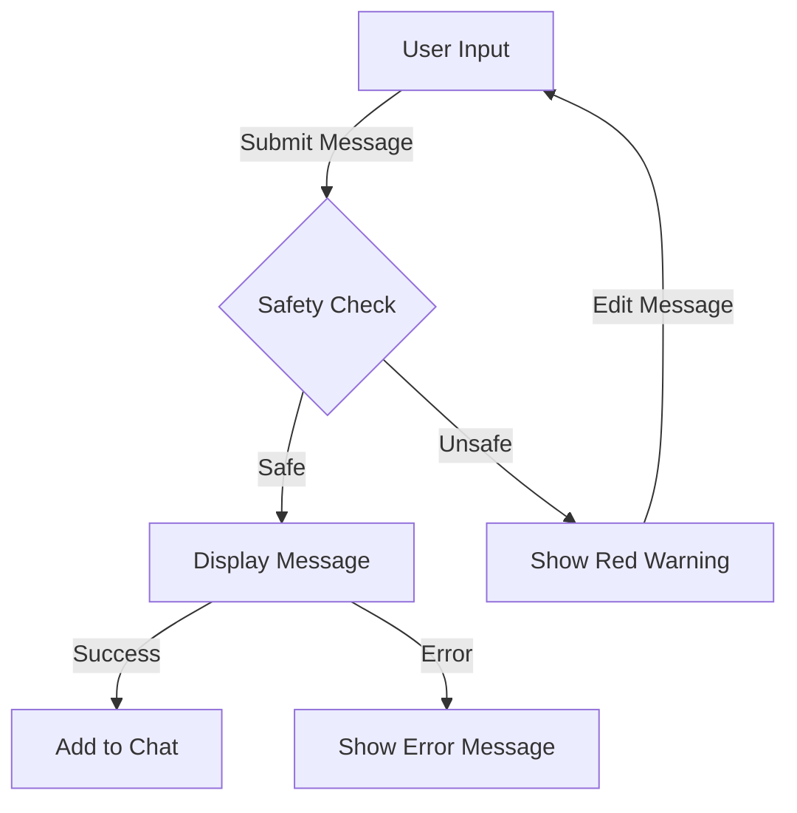

# SafSoc: Smart Message Safety Analysis Platform


## 📋 Overview

SafSoc is an intelligent message safety analysis platform built with React and Express.js that leverages OpenAI's API to evaluate message content for safety concerns in real-time. The platform provides immediate feedback on potentially unsafe content, helping users maintain respectful and secure communication.

## 🌟 Key Features

### Core Functionality
- **Real-time Message Analysis**: Instant evaluation of message safety using OpenAI's advanced AI models
- **Smart Feedback System**: Contextual warnings with detailed explanations and improvement suggestions
- **Visual Alerts**: Red popups for unsafe messages with clear explanations
- **Suggestion System**: Provides constructive feedback for improving message safety

### Web Application Features
- **Simple Interface**: Clean, intuitive design for message input and feedback
- **Instant Feedback**: Real-time safety analysis as you type
- **Message History**: View current session message history
- **Clear Chat**: Option to clear chat history

### Browser Extension Features
- **Universal Compatibility**: Works across all major websites
- **Context-aware Analysis**: Considers website context when evaluating messages
- **Quick Toggle**: Easily enable/disable the extension as needed
- **Seamless Integration**: Works naturally with existing website interfaces

## 🛠️ Technical Architecture

### Frontend (React.js)
- Modern React with Hooks
- Tailwind CSS for responsive design
- ShadcnUI components for consistent UI
- WebSocket for real-time updates

### Backend (Express.js)
- RESTful API architecture
- OpenAI integration
- Message safety analysis
- Error handling middleware

### AI Integration
- OpenAI GPT API integration
- Custom prompt engineering
- Safety evaluation algorithms
- Context-aware analysis

## 🚀 Getting Started

### Prerequisites
```bash
- Node.js (v14 or higher)
- npm or yarn
- OpenAI API key
- Modern web browser
```

### Installation Steps

1. **Clone the Repository**
```bash
git clone https://github.com/prudh-vi/safsoc.git
cd safsoc
```

2. **Install Dependencies**
```bash
# Install frontend dependencies
npm install
```

3. **Environment Setup**
```bash
# Frontend (.env)
REACT_APP_API_URL=https://repo-ecaf.onrender.com/
```

4. **Start Development Server**
```bash
# Start frontend
npm run dev
```

### Browser Extension Installation
1. Open Chrome/Firefox
2. Navigate to Extensions
3. Enable Developer Mode
4. Load unpacked extension from `/extension` directory

## 📚 API Documentation

### Message Analysis Endpoint
```typescript
POST /api/messages
Body: {
  message: string,
  user: string
}
Response: {
  message: string,
  safetyAnalysis: "SAFE" | string
}
```

### Message History
```typescript
GET /api/messages
Query: {
  lastMessageId: number
}
Response: {
  messages: Array<{
    message: string,
    user: string,
    timestamp: number
  }>,
  lastMessageId: number
}
```

### Clear Chat History
```typescript
DELETE /api/messages/clear
Response: {
  success: boolean
}
```

## 🔒 Safety Features

- **Input Sanitization**: Protection against harmful content
- **Content Analysis**: Real-time safety evaluation
- **Warning System**: Clear visual feedback for unsafe content
- **Improvement Suggestions**: Helpful tips for content improvement

## 🔍 Error Handling

The application implements comprehensive error handling:
- Network connectivity issues
- API rate limiting
- Invalid input validation
- Server errors
- Safety check failures

## 📈 Performance Optimization

- Debounced API calls
- Message caching
- Optimized re-renders
- Efficient state management
- Minimized API requests

## 🔄 Workflow



## 🤝 Contributing

1. Fork the repository
2. Create your feature branch (`git checkout -b feature/AmazingFeature`)
3. Commit your changes (`git commit -m 'Add some AmazingFeature'`)
4. Push to the branch (`git push origin feature/AmazingFeature`)
5. Open a Pull Request

## 📄 License

This project is licensed under the MIT License - see the [LICENSE.md](LICENSE.md) file for details.

## 🔗 Links
- [Backend Repository](https://github.com/prudh-vi/repo)
- [Backend Deployment](https://repo-ecaf.onrender.com/)
- [Extension Source](https://github.com/prudh-vi/Safsoc/tree/main/extension)

## ⭐️ Acknowledgments

- OpenAI team for their powerful API
- The React and Express.js communities
- All contributors and testers

---
Made with ❤️ by [Prudhvi](https://github.com/prudh-vi)
